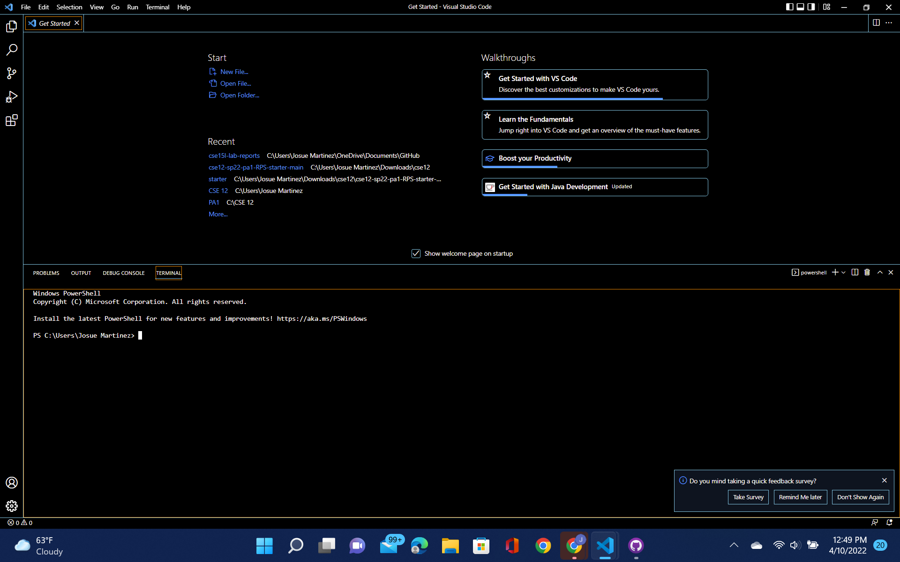

This is my lab report 1.

# 1.  Installing VSCode 

To begin using remote access on your personal device, you will need to have [VSCode](https://code.visualstudio.com/) downloaded. Once you have downloaded VSCode appropriately suited for your operating system, open it and you should see something like this: 

# 2. Remotely Connecting

+ Install OpenSSH(link) in order to connect your personal computer to other computers in the server of your choice and find your CSE15L account here(link) to then access it through VSCode.

+ Once you go back to VSCode and press CTRL + SHIFT + ` , OR  find "Terminal" on the top selection bar and choose "New Terminal". You should see this horizontal split screen that includes your VSCode Get Started (Top Half) and your New Terminal (Bottom Half):

    You will then type "ssh cs15lsp22zz@ieng6.ucsd.edu" replacing the zz with the letters from your course-specific account. You will encounter several messages that to which you will respond by typing "yes" into your terminal. The entire interaction should look like this: 

**⤇ ssh cs15lsp22zz@ieng6.ucsd.edu**

**The authenticity of host 'ieng6-202.ucsd.edu (128.54.70.227)' can't be established.**

**RSA key fingerprint is SHA256:ksruYwhnYH+sySHnHAtLUHngrPEyZTDl/1x99wUQcec.**

**Are you sure you want to continue connecting (yes/no/[fingerprint])?** 

**Password:**
**Last login: Sun Jan  2 14:03:05 2022 from 107-217-10-235.lightspeed.sndgca.sbcglobal.net**
**quota: No filesystem specified.**
**Hello cs15lsp22zz, you are currently logged into ieng6-203.ucsd.edu**

**You are using 0% CPU on this system**

**Cluster Status** 
**Hostname     Time    #Users  Load  Averages**  
**ieng6-201   23:25:01   0  0.08,  0.17,  0.11**
**ieng6-202   23:25:01   1  0.09,  0.15,  0.11**
**ieng6-203   23:25:01   1  0.08,  0.15,  0.11**

**DayName Month Day, Year Ti:me - Prepping cs15lsp22**

# 3. Trying Some Commands 
Next, you should attempt to type some commands into your terminal to learn their outputs. 

Here are some fundamental commands to practice using:

###    **1. cd ~**
> Takes you to home directory.
###    **2. cd**
> Changes to home.
###    **3. ls -a**
> Shows all files, including unconventionaly shown .dot files
###    **4. ls <'directory'>**
> Directory listing. 
###    **5. cp (path to file1) (path to file2)**
> Copy a file or a directory
>> Path example: /home/linux/ieng6/cs15lsp22/public/hello.txt ~/
###    **6. cat (path to file)**
> Create files, prints out contents of a file, concatenate files, and redirects output in terminal or files.

Here is an example of what you may see: 

# 4. Moving Files wtih SCP

# 5. Setting an SSH Key

# 6. Optimizing Remote Running
