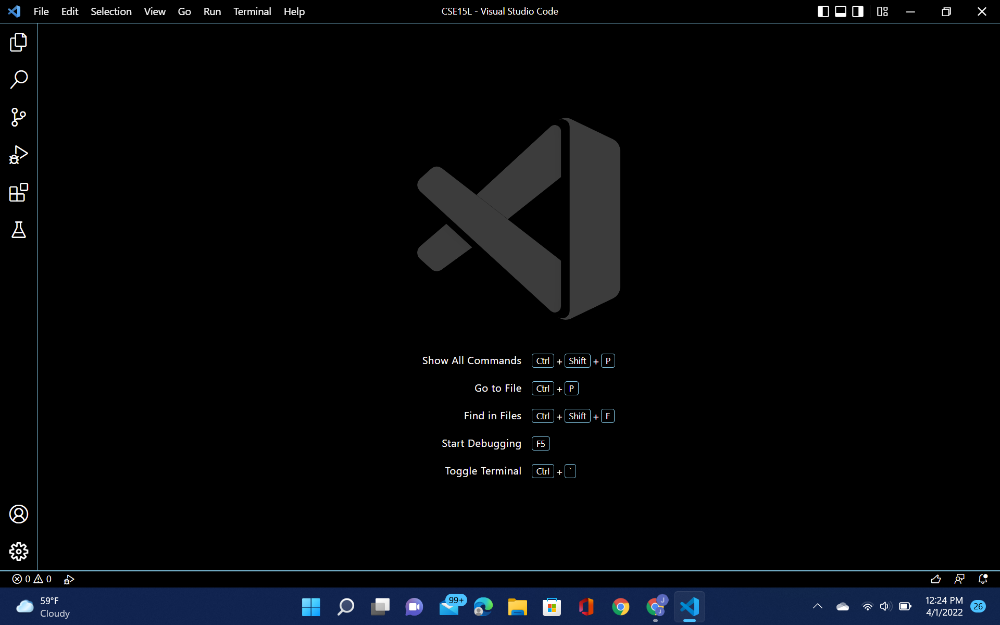

This is my lab report 1.

# 1.  Installing VSCode 

To begin using remote access on your personal device, you will need to have [VSCode](https://code.visualstudio.com/) downloaded. Once you have downloaded VSCode appropriately suited for your operating system, open it and you should see something like this: 

# 2. Remotely Connecting

Install OpenSSH(link) in order to connect your personal computer to other computers in the server of your choice and find your CSE15L account here(link) to then access it through VSCode. Once you go back to VSCode and press CTRL + SHIFT + ` , OR  find "Terminal" on the top selection bar and choose "New Terminal", you should see this horizontal split screen that includes your VSCode Get Started (Top Half) and your New Terminal(Bottom Half):

# 3. Trying Some Commands 

# 4. Moving Files wtih SCP

# 5. Setting an SSH Key

# 6. Optimizing Remote Running
