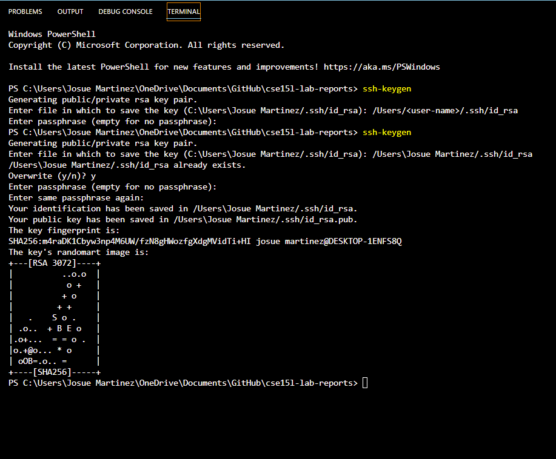

### Lab Report 1
### Josue Martinez A16943817
### CSE 15L Spring 2022

# 1.  Installing VSCode 

To begin using remote access on your personal device, you will need to have [VSCode](https://code.visualstudio.com/) downloaded. Once you have downloaded VSCode appropriately suited for your operating system, open it and you should see something like this: )

# 2. Remotely Connecting

+ Install OpenSSH(link) in order to connect your personal computer to other computers in the server of your choice and find your CSE15L account here(link) to then access it through VSCode.

+ Once you go back to VSCode and press CTRL + SHIFT + ` , OR  find "Terminal" on the top selection bar and choose "New Terminal". You should see this horizontal split screen that includes your VSCode Get Started (Top Half) and your New Terminal (Bottom Half):

    You will then type "ssh cs15lsp22zz@ieng6.ucsd.edu" replacing the zz with the letters from your course-specific account. You will encounter several messages that to which you will respond by typing "yes" into your terminal. The entire interaction should look like this: 

**⤇ ssh cs15lsp22zz@ieng6.ucsd.edu**

**The authenticity of host 'ieng6-202.ucsd.edu (128.54.70.227)' can't be established.**

**RSA key fingerprint is SHA256:ksruYwhnYH+sySHnHAtLUHngrPEyZTDl/1x99wUQcec.**

**Are you sure you want to continue connecting (yes/no/`[Fingerprint]`)?** 

**Password:**
**Last login: Sun Jan  2 14:03:05 2022 from 107-217-10-235.lightspeed.sndgca.sbcglobal.net**
**quota: No filesystem specified.**
**Hello cs15lsp22zz, you are currently logged into ieng6-203.ucsd.edu**

**You are using 0% CPU on this system**

**Cluster Status** 
**Hostname     Time    #Users  Load  Averages**  
**ieng6-201   23:25:01   0  0.08,  0.17,  0.11**
**ieng6-202   23:25:01   1  0.09,  0.15,  0.11**
**ieng6-203   23:25:01   1  0.08,  0.15,  0.11**

**DayName Month Day, Year Ti:me - Prepping cs15lsp22**

# 3. Trying Some Commands 
Next, you should attempt to type some commands into your terminal to learn their outputs. 

Here are some fundamental commands to practice using:

###    **1. cd ~**
> Takes you to home directory.
###    **2. cd**
> Changes to home.
###    **3. ls -a**
> Shows all files, including unconventionaly shown .dot files
###    **4. ls <'directory'>**
> Directory listing. 
###    **5. cp (path to file1) (path to file2)**
> Copy a file or a directory
>> Path example: /home/linux/ieng6/cs15lsp22/public/hello.txt ~/
###    **6. cat (path to file)**
> Create files, prints out contents of a file, concatenate files, and redirects output in terminal or files.

Here is an example of what you may see if you have files within your chosen directory: 

# 4. Moving Files wtih SCP
Begin by creating a java file called WhereAmI with the following code: 

`class WhereAmI {`

`public static void main(String[] args) {
    System.out.println(System.getProperty("os.name"));
    System.out.println(System.getProperty("user.name"));
    System.out.println(System.getProperty("user.home"));
    System.out.println(System.getProperty("user.dir"));`
 `}`

`}`

Compile by using "`javac WhereAmI.java`" and run with "`java WhereAmI`" both in your terminal.

Next, in your own terminal, not the account, you will write this command using your own account information. 

`scp WhereAmI.java cs15lsp22zz@ieng6.ucsd.edu:~/`

Once you have inserted your password, you will log in into the remote server using ssh like before. You will type the command `ls` to list all the files in the remote server. You should see something like this to verify your file has been properly transferred from your personal computer to the remote computer:

> The java file contains print statements that produce OS name, user name, user home, and user directory. The lower left split screen is the server side and the lower right split screen is the user side.

# 5. Setting an SSH Key
We will now create an SSH key that will make the server login process far more efficient by skipping past the SSH $->$ PASSWORD commitment. 

1. First, open your terminal on your user/client side and type `ssh-keygen`, to which you will be prompted with a messages like this:

2. You will replace `<user-name>` with your User's name and press `Enter` to input an empty passphrase when prompted for it (for efficiency reasons).

    Doing so will produce a randomart like... 

3. Next you will log into the remote server using the usual ssh command. You will use the `mkdir .ssh` (you may get a message saying it already exists which is okay).

4. Return to client/user side and enter `scp /Users/<user-name>/.ssh/id_rsa.pub cs15lsp22zz@ieng6.ucsd.edu:~/.ssh/authorized_keys`
    > Again, replace with personal username and change to your saved path

Now, you will be able to enter the remote server without needing to enter your password. 

# 6. Optimizing Remote Running
We can now optmize commands on this remote server by skipping multiple steps thanks to the SSH Key to bypass unnecessary dirty work. We modify files locally by using the following recursive commands:

+ Using `ssh cs15lsp22zz@ieng6.ucsd.edu "ls"` or any command in quotations will first login and then run the ls or any command simultaneously. 
+ Additionally, you can use semicolons to differentiate which commands to run in order given the placement of the semicolons. Use `cp WhereAmI.java OtherMain.java; javac OtherMain.java; java WhereAmI` as an example.
+ Pressing the up keyboard will recall the most recent command you used. 

As a result you can run a layered command to skip several single-instance commands:

## Thank you for visiting.
