# <center>Lab Report 4</center>
---
## Josue Martinez 

A16943817
#### CSE 15L
####  5/22/2022

## <center>MarkdownParse Repositories</center>
Here is the link to our __[repository.](https://github.com/jina-leemon/markdown-parser)__

...and here's the link to find our reviewed __[repository.](https://github.com/TheJoeship/markdown-parser-fork)__


## <center>Test Snippet One</center>
```markdown
`[a link`](url.com)

[another link](`google.com)`

[`cod[e`](google.com)

[`code]`](ucsd.edu)

```
### Expected Output:
<center>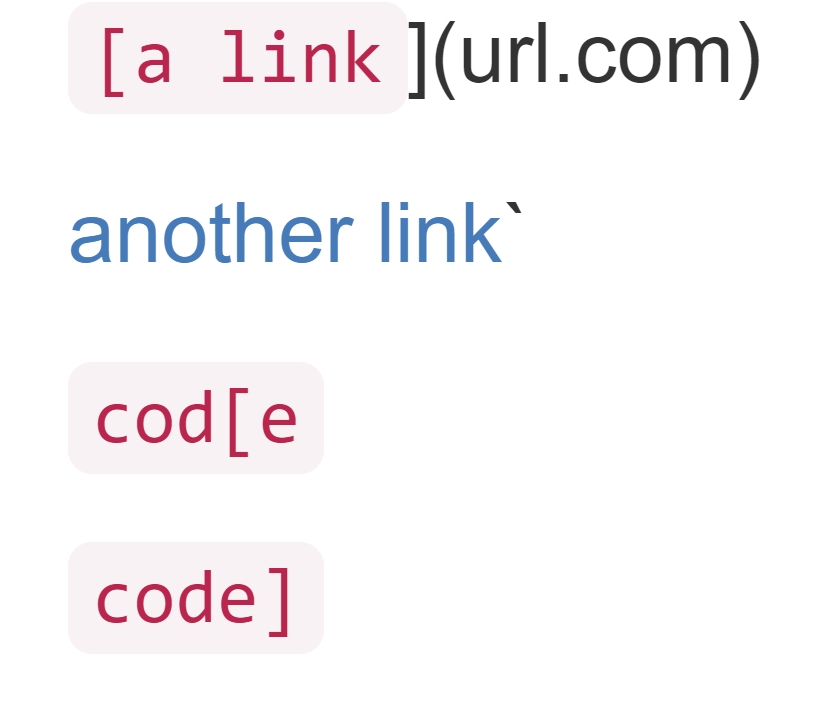</center>
    
    
    After running this test snippet, it is expected to find that only "another link" should be considered an actual link; while the other three attempted links aren't considered as such. 

### Test Created
<center>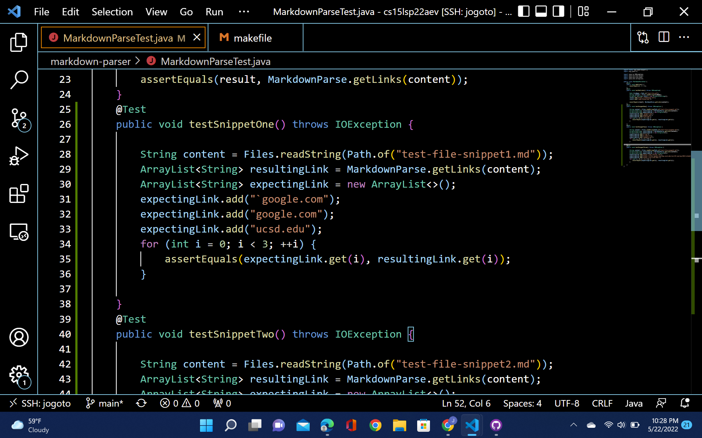</center>

### Actual Output of My Implementation (Show JUnit output if it failed)
<center>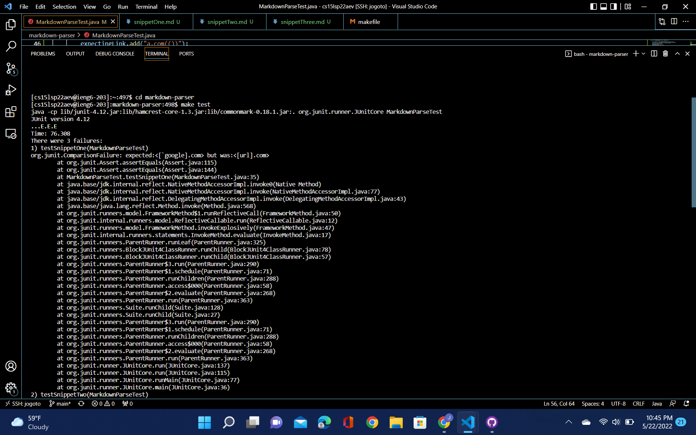</center>


### Actual Output of Reviewed Implementation (Show JUnit output if it failed)

<center>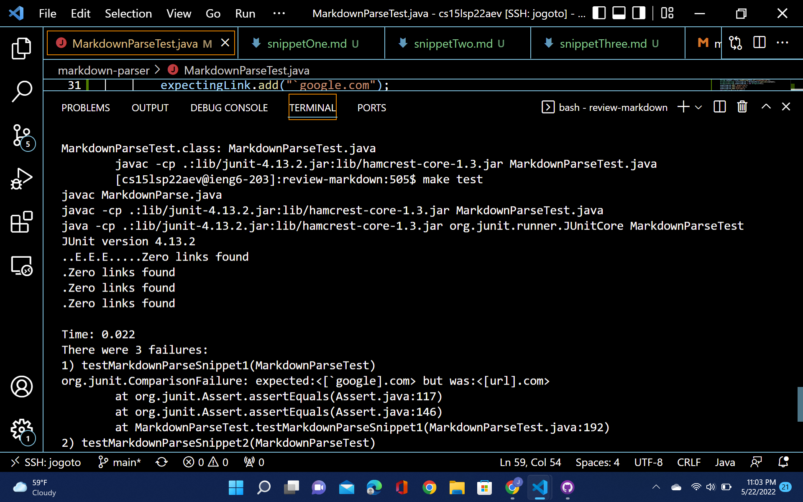</center>


## <center>Test Snippet Two</center>
```markdown
[a [nested link](a.com)](b.com)

[a nested parenthesized url](a.com(()))

[some escaped \[ brackets \]](example.com)
```
### Expected Output
    After running this test snippet it is expected to find that all three attempted links actually result in successful links. However, with some noticeable differences that can represent either serious failings of the person trying to link or embedded links. 

<center>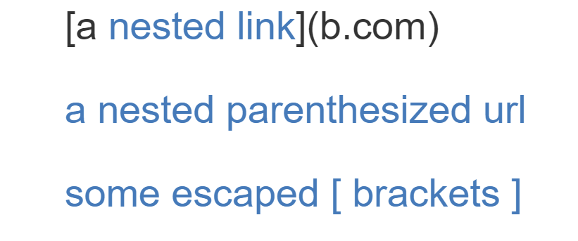</center>


### Test Created

<center>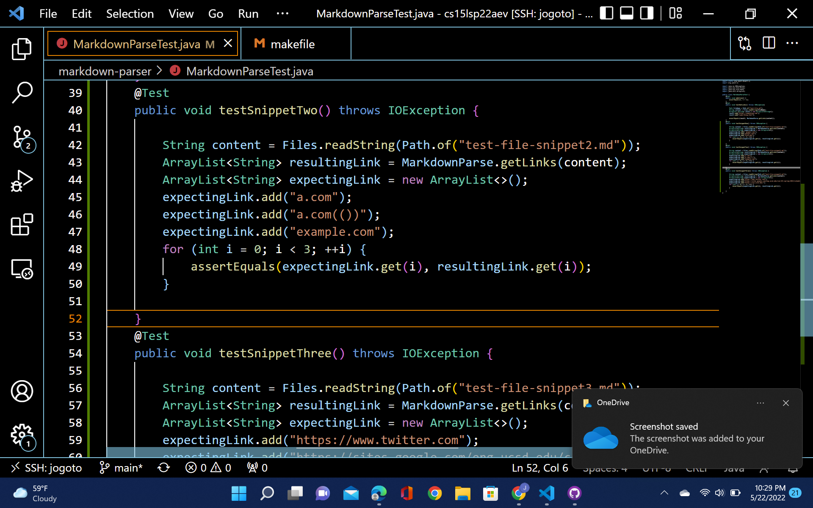</center>

### Actual Output of My Implementation (Show JUnit output if it failed)

<center>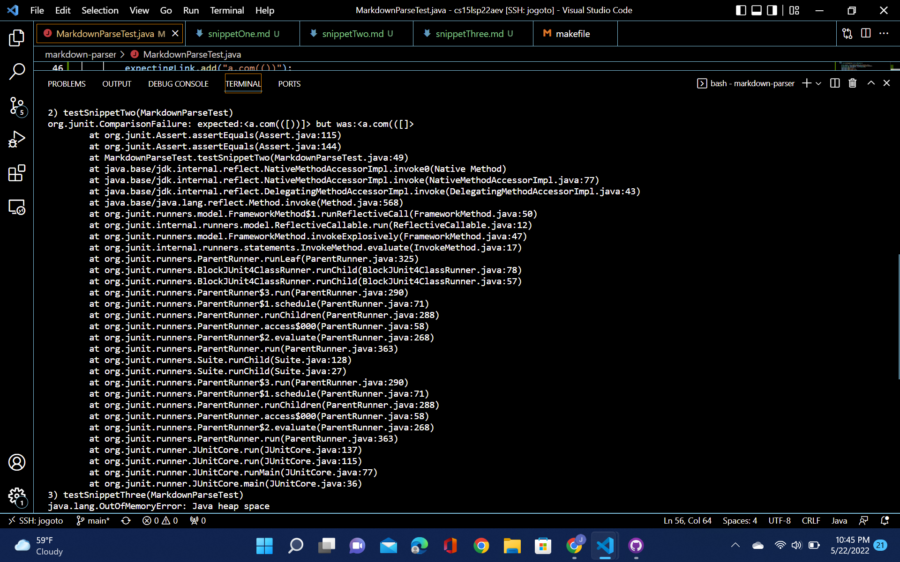</center>

### Actual Output of Reviewed Implementation (Show JUnit output if it failed)

<center>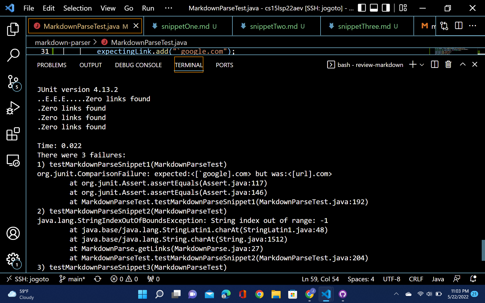</center>


## <center>Test Snippet Three</center>
```markdown
[this title text is really long and takes up more than 
one line

and has some line breaks](
    https://www.twitter.com
)

[this title text is really long and takes up more than 
one line](
https://sites.google.com/eng.ucsd.edu/cse-15l-spring-2022/schedule
)


[this link doesn't have a closing parenthesis](github.com

And there's still some more text after that.

[this link doesn't have a closing parenthesis for a while](https://cse.ucsd.edu/


)

And then there's more text
```
###    Expected Output
    After running this test snippet it is expected to only find one successful link that is a text bracket that doesn't fit on one line. Unfortunately, the other tests are not recognized as links which is due to the fact that they are either have text brackets that don't fit on one line AND has some breaks, a link that doesn't have a closing parenthesis, or a link that has a closing parenthesis far after the link. 

<center>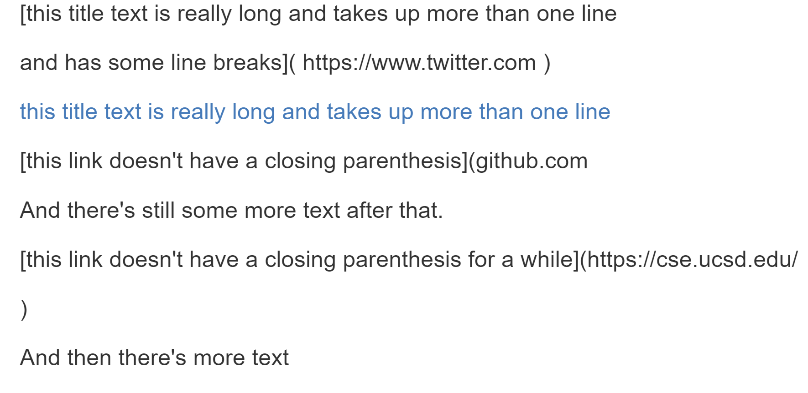</center>

 ###   Test Created

<center>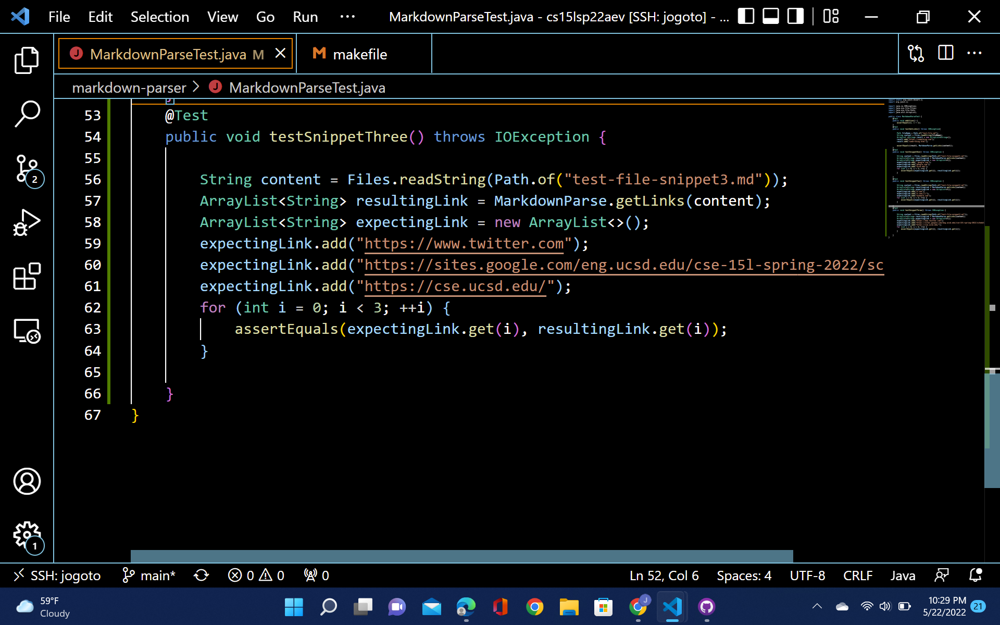</center>

###    Actual Output of My Implementation (Show JUnit output if it failed)

<center>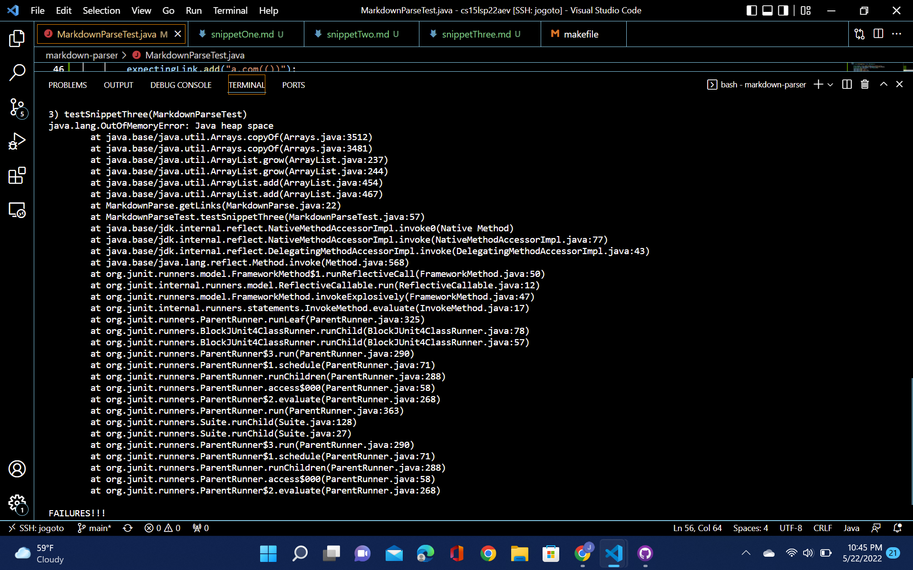</center>

###    Actual Output of Reviewed Implementation (Show JUnit output if it failed)

<center>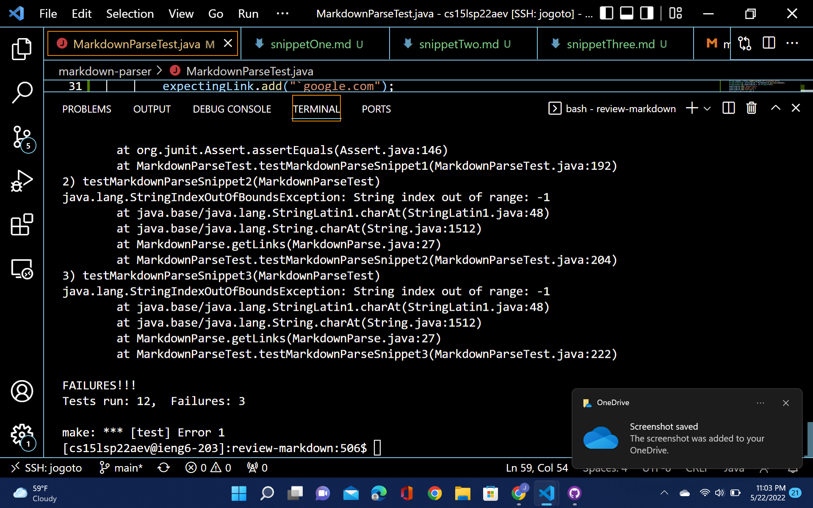</center>

## <center></center>
Do you think there is a small (<10 lines) code change that will make your program work for snippet 1 and all related cases that use inline code with backticks? If yes, describe the code change. If not, describe why it would be a more involved change.

    I believe I can make a slight adjustment to my current code to make this snippet and relevant cases work. All I would have to do is create an `if` statement that makes detects and tracks the length of a code segment and to void it. 

Do you think there is a small (<10 lines) code change that will make your program work for snippet 2 and all related cases that nest parentheses, brackets, and escaped brackets? If yes, describe the code change. If not, describe why it would be a more involved change.

    I don't think a small code change would be enough to properly solve this programming issue. The snippet and relevant nested paratheses, brackets, and escaped brackets cases would require more case handling which I believe would exceed the 9 line limit.

Do you think there is a small (<10 lines) code change that will make your program work for snippet 3 and all related cases that have newlines in brackets and parentheses? If yes, describe the code change. If not, describe why it would be a more involved change.

    Again, I believe a small code change would be enough to properly solve this programming issue. The snippet and relevant  newlines in brackets and parentheses cases would require more case handling which I believe would exceed the 9 line limit.

# <center>Thank you for visiting!</center>